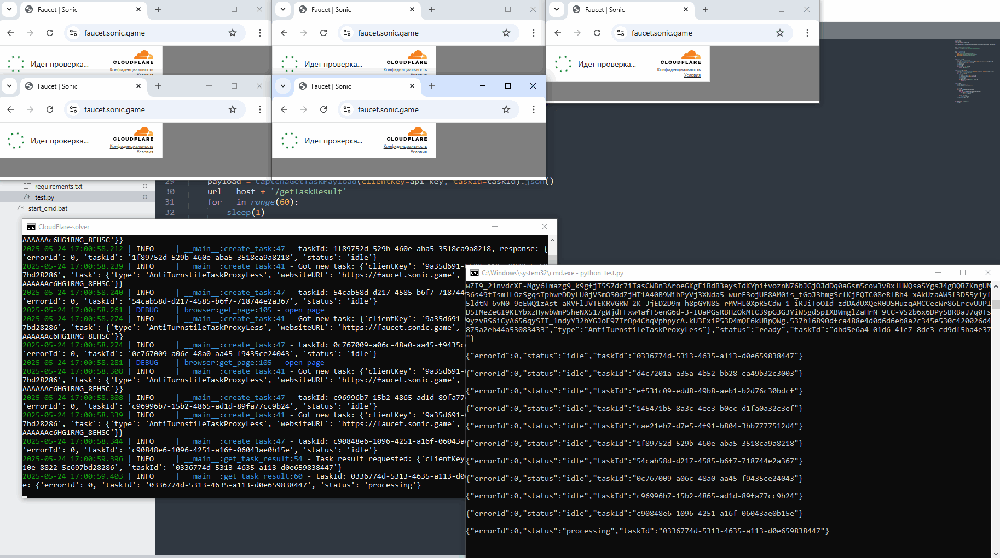

# CloudFlare Turnstile Solver
[](https://t.me/bots_forge)

<p align="center">
  
</p>

A local server for solving CloudFlare Turnstile CAPTCHA challenges and returning ready-to-use tokens. This tool automates the process of solving Turnstile CAPTCHAs, which can be integrated into your applications that need to bypass CloudFlare protection. You can use it in your bots by making requests to this local server with CAPTCHA tasks and receiving ready tokens in response.
## Features

- Solves CloudFlare Turnstile CAPTCHA challenges
- Returns ready-to-use tokens
- Supports multiple concurrent solving tasks
- Simple REST API for integration
- Asynchronous processing for better performance

## Demo

<p align="center">
  
</p>

## Requirements

- Python >= 3.10

## Installation

1. Clone the repository:
```bash
git clone https://github.com/BotsForge/CloudFlare.git
cd CloudFlare
```

2. Install the required dependencies:
```bash
pip install -r requirements.txt
```

3. Create a `.env` file in the root directory based on the example below.

This project uses [patchright-python](https://github.com/Kaliiiiiiiiii-Vinyzu/patchright-python) for browser automation. Special thanks to its creators.


## Usage

### Starting the Server

Run the application:
```bash
python app.py
```

The server will start on `http://localhost:5033` by default.

### API Endpoints

#### Create a CAPTCHA Solving Task

```
POST /createTask
```

Request body:
```json
{
  "clientKey": "your_api_key",
  "task": {
    "type": "AntiTurnstileTaskProxyLess",
    "websiteURL": "https://example.com",
    "websiteKey": "0x4AAAAAAAc6HG1RMG_8EHSC"
  }
}
```

Response:
```json
{
  "taskId": "12345678-1234-1234-1234-123456789012",
  "status": "idle"
}
```

#### Get Task Result

```
POST /getTaskResult
```

Request body:
```json
{
  "clientKey": "your_api_key",
  "taskId": "12345678-1234-1234-1234-123456789012"
}
```

Response (when ready):
```json
{
  "taskId": "12345678-1234-1234-1234-123456789012",
  "status": "ready",
  "solution": {
    "token": "03AFY_a8UAzGWJsGKzUVMDRzk9..."
  }
}
```

### Example Usage

Here's a simple example of how to use the API with Python:

```python
import httpx
from time import sleep

# API configuration
host = 'http://127.0.0.1:5033'
api_key = 'your_api_key'

# Create a task
def create_task():
    url = host + '/createTask'
    payload = {
        "clientKey": api_key,
        "task": {
            "type": "AntiTurnstileTaskProxyLess",
            "websiteURL": "https://example.com",
            "websiteKey": "0x4AAAAAAAc6HG1RMG_8EHSC"
        }
    }
    r = httpx.post(url, json=payload)
    r = r.json()
    if r['status'] == 'idle':
        return r['taskId']

# Get the result
def get_result(taskId):
    payload = {
        "clientKey": api_key,
        "taskId": taskId
    }
    url = host + '/getTaskResult'
    for _ in range(60):
        sleep(1)
        r = httpx.post(url, json=payload)
        r = r.json()
        if r['status'] in ('error', 'ready'):
            return r

# Usage
if __name__ == '__main__':
    if taskId := create_task():
        result = get_result(taskId)
        print(result)
```

## Testing

You can test the application using the provided test script:

```bash
python test.py
```

This script will create multiple CAPTCHA solving tasks and retrieve their results.

## Environment Variables

Before starting the application, you need to create a `.env` file in the root directory. You can configure the application using the following environment variables:

- `PORT`: The port on which the server will run (default: 5033)
- `LOG_LEVEL`: The logging level (default: INFO)
- `max_workers`: Maximum number of concurrent workers (default: 1)
- `API_KEY`: Your API key for authenticating requests to the server
- `PROXY`: Your proxy configuration (optional)

### Example .env file

```
max_workers=2

PROXY=username:password@host:port

PORT=5033
API_KEY=9a35d691-6522-410e-8822-5c697bd28286
LOG_LEVEL=DEBUG
```

## Support
Developed by `MrSmith06`: [telegram](https://t.me/Mr_Smith06) |  [gtihub](https://github.com/MrSmith06)
If you find this project helpful, feel free to leave a tip!
- EVM address (metamask): `0x6201d7364F01772F8FbDce67A9900d505950aB99`
